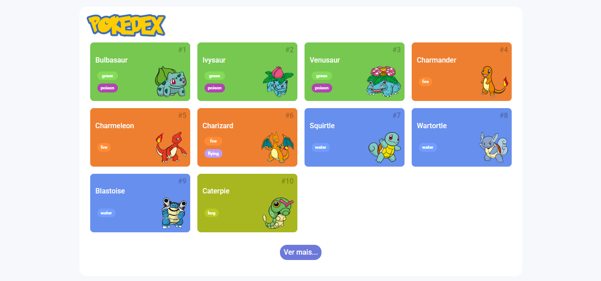

# ⚔️ Desafio: Pokedex com Consumo de API REST
**Projeto:** Este repositório contém a solução do desafio Pokedex da DIO. O objetivo é explorar a API REST do universo Pokémon para criar uma Pokédex funcional, utilizando JavaScript e os fundamentos do desenvolvimento Web aprendidos na plataforma.

# 🎯 Deploy do Desafio
🔗 [Clique aqui para acessar a página](https://pokedex-api-dio.netlify.app/)



# 🗂️ Estrutura do Projeto

```
📁 .github
📁 assets
┣ 📁 css
┣ 📁 images
┗ 📁 js
┣ 📄 detail.js
┣ 📄 main.js
┣ 📄 poke-api.js
┗ 📄 pokemon-model.js
📄 index.html
📄 pokemon-detail.html
📄 README.md 
```
# 🖥️ Tecnologias Utilizadas
[]()
[]() 
[]() 

# 📌 Regras do Desafio
### O que deve ser utilizado:

- Consumo de API REST utilizando JavaScript (fetch)
- Manipulação do DOM para exibir dados
- Fundamentos de desenvolvimento Web (HTML, CSS, JS)
- Estruturas de dados e controle de fluxo em JavaScript

### Objetivo:

Consumir os dados da API Pokémon e exibir uma Pokédex com informações relevantes de cada Pokémon, como nome, imagem, tipo, e outras características.

Funcionalidades Esperadas:
- Exibir lista de Pokémon com imagens e nomes
- Permitir busca ou navegação entre Pokémons
- Mostrar detalhes principais de cada Pokémon buscado

Exemplo de saída esperada:

```
Nome: Pikachu  
Tipo: Elétrico  
Imagem: (imagem do Pokémon) 
```

## 🔗 Links de Referência

- [Plataforma DIO](https://web.dio.me/)
- [Deploy Netlify](https://pokedex-api-dio.netlify.app/)

## 👨‍💻 Autor

- Desenvolvido por [Rafael Moreira](https://github.com/RafaeltiMoreira)
